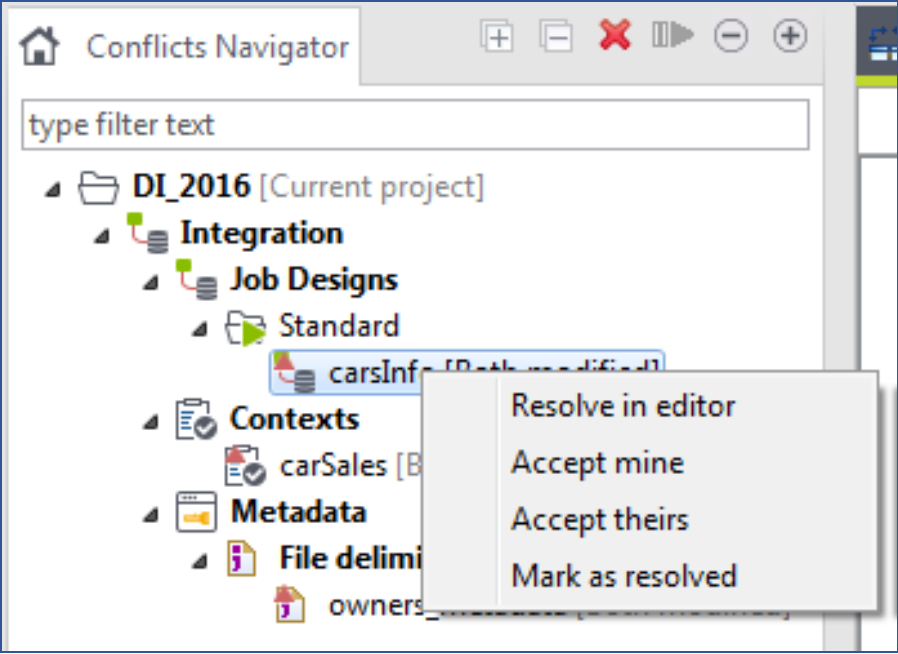
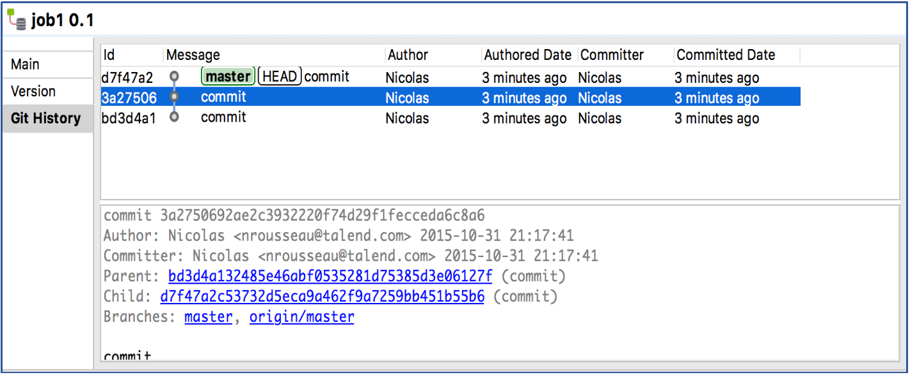
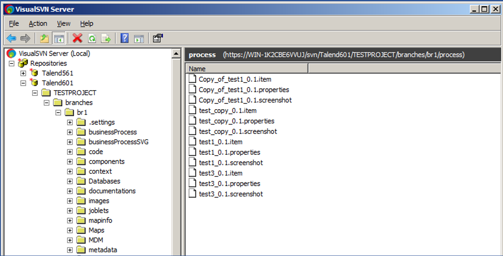
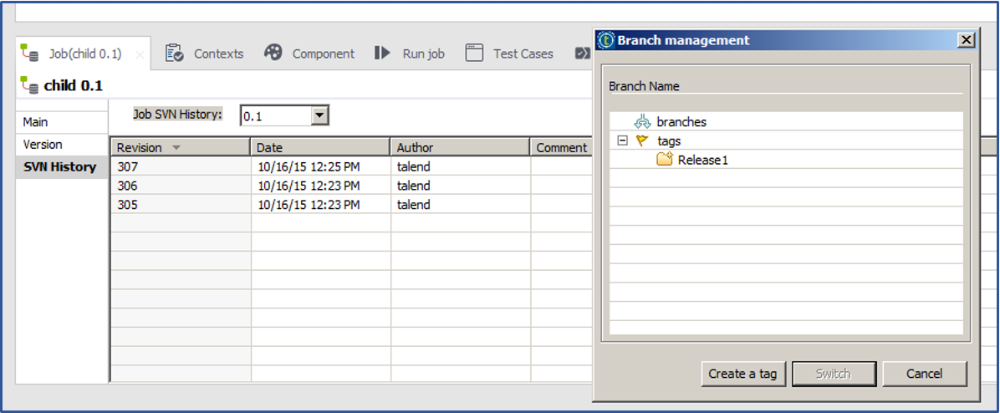

# Metadata Repository

The Subversion (SVN) or Git version control tools are used as repositories to centralize all project metadata like Jobs and Business Models shared between different end-users, and accessible from the Talend Studio to develop them and from Talend Administration Center to publish, deploy and monitor them. There are different best practices when using Subversion versus Git. The use of either Git or Subversion will determine how your Software Development Life Cycle will look like and what you can achieve as SDLC.

Read the [Why Git and not Subversion?](#Why-Git-and-not-Subversion) section to understand why Talend recommends using Git over Subversion.

## GIT
Git was added to Talend fromm  v6.1 and it follows the same workflow as SVN – no advanced GIT functions supported. From
6.2 onwards provides a full GIT workflow (GIT local mode, GIT merge) – making it the preferred choice over SVN. Gitflow and Feature Branch workflows supported along with Tagging and branching as part of SDLC.

Please refer to the [Git Best Practices][git-best-practices] to learn how to best leverage it as a repository and how to setup 1 project per repository.

#### Conflict

#### Browsing

Technical Details for GIT:
- Server Component
- Common distributions and SaaS platforms supported -  see documentation
- GIT used in DEV Environment Only.

## SVN
SVN can also be for Talend Project Metadata (Jobs, Connections, Schema Definitions etc. in XML & Properties files). It provides a versioning system for Talend objects / projects along with Tagging and branching as part of SDLC. It does NOT store binaries of Jobs nor support SVN Merge.

#### Browse

#### History

Technical Details for SVN:
- Server Component
- Apache Subversion is a software versioning and revision control system
- Distributed as free software under the Apache License
- Common distributions supported – see documentation
- SVN 1.9 and 1.8 supported
- Used in Development Environment Only

To read and understand how to work collaboratively on project items please read [help documentation][collaboration]

## Why Git and not Subversion?
Talend recommends Git over Subversion for the following reasons:
- Job merge capabilities
- Talend support remote and local workspace capabilities. Developers can work with local workspace, hence reducing the amount of network traffic between the Talend Administration Center and the Git repositories
- It is better suited for geographically distributed teams where network bandwidth may be a challenge (due to capability to use local workspace)
- It is the more popular and well know version control system nowadays
- It will be easier to move to cloud in the future since Talend Cloud can connect to Git repositories.

Limitations of using Subversion with Talend:
- Talend does not support job merge capability when using Subversion
- Talend uses a remote connection to Subversion and relies on an available Subversion connection to be able to commit and save items
- It can become very chatty with Subversion as project size grows, hence, network bandwidth may impact the developer experience

For all new implementations of Talend, we strongly recommend implementing Git as a source repository.

<!-- links -->
[collaboration]: https://help.talend.com/reader/fE51zt3EBkq3lp1Op6DPEw/MkhI3NR6ziwnUNSmUXt7Ig "Working collaboratively on project items"
[git-best-practices]: https://help.talend.com/reader/zmpiBOca3cKh0pRmyEjMJQ/sgumrF0lHmYxda9K27HEyQ "Best Practices: Using Git with Talend 6.2 and later versions"
